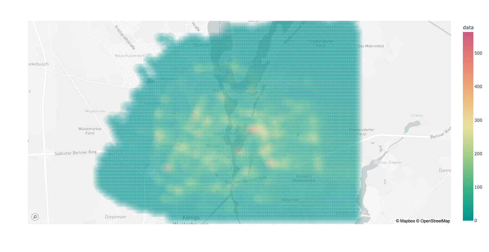

# Wildau Use Case: SUMO2GRAL Tool Tutorial

## Overview

This tutorial guides you through utilizing the SUMO2GRAL tool for pollutant dispersion simulation using data from Wildau, Germany. This scenario leverages the Wildau dataset from the [SUMO scenarios repository](https://github.com/DLR-TS/sumo-scenarios/tree/main/Wildau).

## Prerequisites

Before beginning, ensure you have:

- Completed the [setup](../../README.md#setup) including the installation of all dependencies.
- Executed the Wildau SUMO simulation to produce the [edge emissions file](https://sumo.dlr.de/docs/Simulation/Output/Lane-_or_Edge-based_Emissions_Measures.html) by running for instance `sumo -c emissions.sumocfg` in the Wildau directory obtained above.
- An OSM file for Wildau, obtainable from the [SAGA repository](https://github.com/lcodeca/SUMOActivityGen/raw/master/tests/wildau_osm.xml.gz) or directly from [OpenStreetMap](https://www.openstreetmap.org/).
- The GRAL software, downloadable from [GRAL's website](https://gral.tugraz.at/) or the [GRAL GitHub repository](https://github.com/GralDispersionModel/GRAL).
- Meteorological data compatible with GRAL. Use the provided [weather.met example](/weather/examples/weather.met) or convert a .csv file like [this example](/weather/examples/standard_input_weather_data.csv) into a .met file using the SUMO2GRAL tool. For detailed usage instructions, visit the [weather processor documentation](https://seniel98.github.io/SUMO2GRAL/weather/weather_processor/#usage).
- A designated base directory for storing simulation files and outputs.

## Required Data

Use the `wildau.sumo2gral.cfg` configuration file for the simulation. This file should be placed in the [repository's root directory](wildau.sumo2gral.cfg) and includes:

- Network file: `wildau.net.xml`
- Edges emissions file: `wildau.emissions.xml`
- OSM file: `wildau.osm.xml`
- Weather file: `wildau_weather.met`
- GRAL dll file: `GRAL.dll`

## Configuring GRAL Simulation Parameters

The GRAL simulation parameters within `wildau.sumo2gral.cfg` include:

- **Pollutant**: The target pollutant (options include `NO2`, `PM10`, `PM2.5`, `CO`, `SO2`, `HC`).
- **Horizontal Layers**: Layer heights for measuring pollutant concentrations.
- **Particles Per Second**: Total Lagrangian particles released per dispersion situation for accuracy.
- **Dispersion Time**: Averaging time for concentration values, e.g., 1800s for half-hourly or 3600s for hourly values.
- **Number of CPU Cores**: Allocated CPU cores for the simulation.

## Simulation Execution

Run the simulation with the following command:

```bash
python cli.py -c wildau.sumo2gral.cfg --process all
```

This command prepares all necessary GRAL files and executes the simulation. The output is a .txt file formatted as a matrix showing the pollutant concentration across the grid. [Here's an example output](results/results_weather_1_NOx_6m.txt).

Output filenames follow the pattern: `[Weather situation]_[Pollutant]_[Layer height].txt`.

## Displaying Results

To visualize the pollutant concentration map, use the following command:

```bash
python cli.py --process results --display-geo-map -r results/results_weather_1_NOx_6m.txt --mapbox-api-key your_mapbox_api_key
```

This command displays the pollutant concentration map using Mapbox. Replace `your_mapbox_api_key` with your API key (see how to [create your API KEY](https://docs.mapbox.com/help/getting-started/access-tokens/)).

### Example Output

Results are displayed as a scattermapbox plot with pollutant concentration values. The following image shows the NOx concentration (ug/m3) map for Wildau, Germany.

